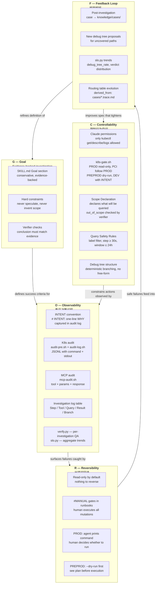
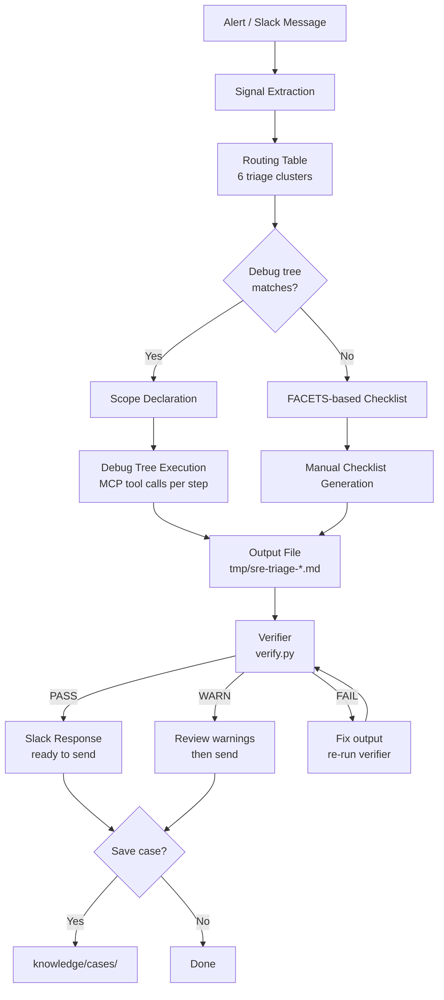
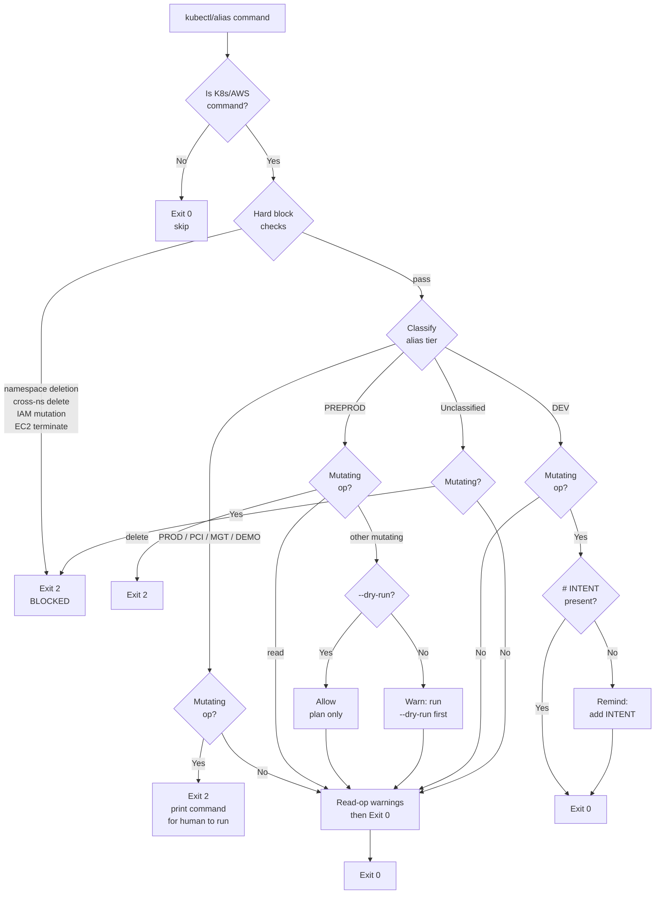
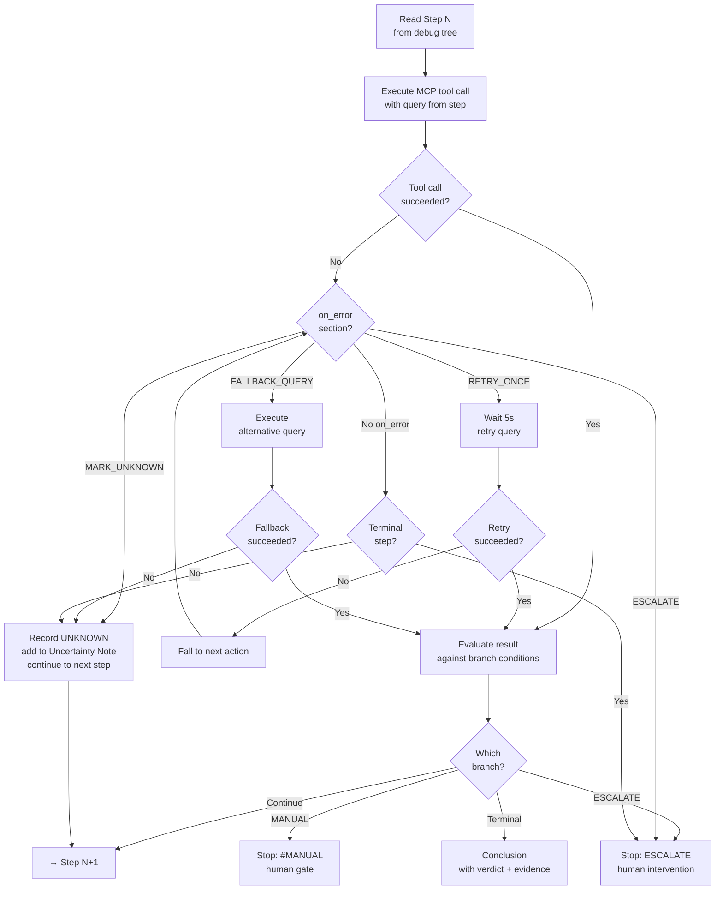
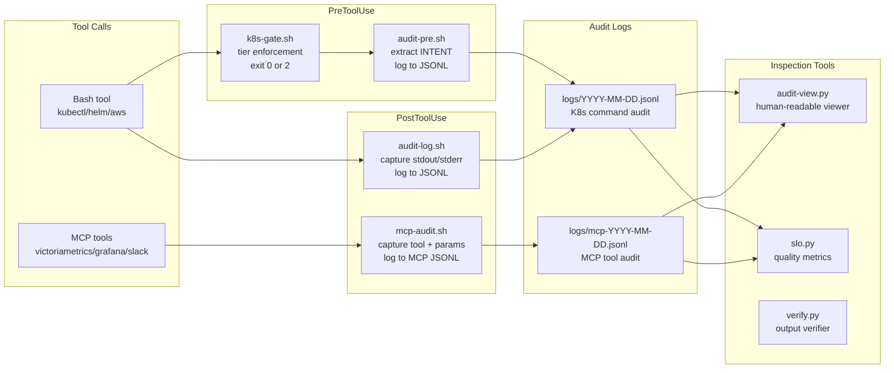
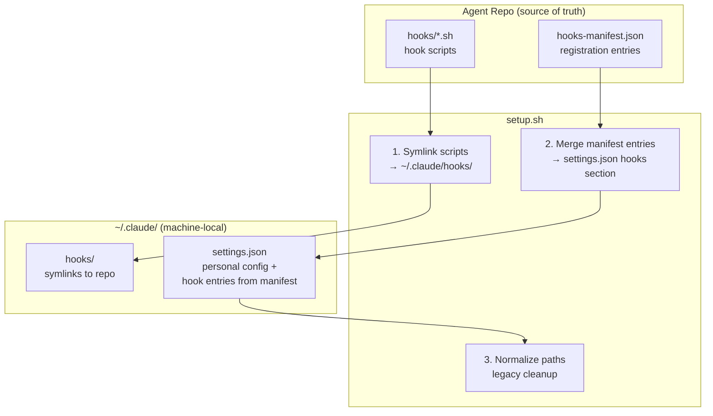

# SRE Oncall Triage Agent — Architecture

## 0. GCORF Design Framework

GCORF（Goal / Controllability / Observability / Reversibility / Feedback Loop）是这个 agent 的设计框架。每个维度不是独立模块，而是贯穿整个系统的设计约束。

### GCORF → 实现映射

| 维度 | 设计问题 | sre_oncall_triage_agent 实现 | 关键文件 |
|------|---------|------------------|---------|
| **G — Goal** | agent 的目标是什么？怎么定义"成功"？ | Evidence-backed investigation, not speculation. 成功 = 正确 triage + 保守 Slack response + 完整 evidence chain. | `SKILL.md` (Goal / Hard constraints) |
| **C — Controllability** | 怎么限制 agent 的行为空间？ | 三层防线：Claude permissions → hook chain (k8s-gate.sh tier 强制) → agent spec (read-only + scope declaration + query safety rules + debug tree deterministic branching) | `k8s-gate.sh`, `SKILL.md`, debug trees |
| **O — Observability** | 怎么看见 agent 的决策过程？ | INTENT convention (why, not just what) + K8s audit JSONL + MCP audit JSONL + investigation log table (每步 tool/query/result/interpretation) + verify.py (输出质量) + slo.py (趋势) | `audit-pre.sh`, `mcp-audit.sh`, `verify.py`, `slo.py` |
| **R — Reversibility** | 出错了怎么回退？ | Read-only investigation = nothing to reverse. 所有 mutation 走 #MANUAL gate, PROD tier agent 只打印命令不执行, PREPROD 先 --dry-run. Post-investigation case 存储是 opt-in ("要存吗？") | `k8s-gate.sh`, runbook `#MANUAL` markers |
| **F — Feedback Loop** | agent 怎么越用越好？ | Post-investigation case creation → knowledge/cases/. Debug tree proposal for new paths. slo.py 追踪质量趋势. Routing table 本身 derived_from cases (metadata 里声明了). verify.py 每次调查都检查质量退化. | `slo.py`, `knowledge/cases/`, `agent-routing-table.md` |

### GCORF 架构图

### GCORF 与 SRE 的同构关系

| GCORF 维度 | SRE 等价物 | sre_oncall_triage_agent 等价物 |
|-----------|-----------|-------------------|
| **Goal** | SLI/SLO — 定义"可靠"的数值含义 | Task success rate + evidence chain completeness |
| **Controllability** | RBAC + blast radius 控制 | Tier enforcement + scope declaration + query safety |
| **Observability** | Metrics + logs + traces (OpenTelemetry) | INTENT audit + MCP audit + investigation log + verify/slo |
| **Reversibility** | Rollback + canary + blue-green | Read-only default + #MANUAL gate + --dry-run + "print command for human" |
| **Feedback Loop** | Postmortem → action items → SLO refinement | Case creation → routing table evolution → debug tree expansion |

关键洞察：**GCORF 的五个维度形成一个闭环**。Feedback Loop 改进 Controllability（新 case 产生新的 routing rule），Controllability 约束 Observability 的范围（scope declaration 告诉你该看什么），Observability 暴露 Reversibility 的需要（verify.py 发现问题），Reversibility 的安全回退产生新的 Feedback（失败 case 也是学习材料）。

---

## 1. Investigation Pipeline

Alert 从输入到输出的完整流程。

## 2. Safety Layers

三层防线，从外到内。每层解决不同的问题。

```mermaid
flowchart LR
    subgraph L1["Layer 1: Claude Code Permissions<br/>(settings.json)"]
        P1[permissions.allow<br/>只列了 kubectl get/describe/logs]
        P2[permissions.deny<br/>显式封 delete ns/drain/cordon]
        P3[未列入 allow 的命令<br/>弹 permission prompt]
    end

    subgraph L2["Layer 2: Hook Chain<br/>(PreToolUse / PostToolUse)"]
        direction TB
        H1[k8s-gate.sh<br/>环境 tier 强制执行]
        H2[audit-pre.sh<br/>INTENT 记录]
        H3[audit-log.sh<br/>kubectl 执行结果审计]
        H4[mcp-audit.sh<br/>MCP tool call 审计]
    end

    subgraph L3["Layer 3: Agent Spec<br/>(SKILL.md + Debug Trees)"]
        S1[Hard constraints<br/>read-only investigation only]
        S2[Query Safety Rules<br/>label filter / step floor / time ceiling]
        S3[Scope Declaration<br/>out_of_scope 声明]
        S4[on_error handling<br/>失败时的标准化行为]
    end

    L1 --> L2 --> L3
```

## 3. Environment Tier Enforcement

k8s-gate.sh 如何按集群环境分级处理命令。

## 4. Debug Tree Execution Model

单个 debug tree step 的执行逻辑，包括 on_error 处理。

## 5. Audit & Observability

四个 hook 的触发时机和数据流。

## 6. Hook Registration Model

hooks-manifest.json 作为 source of truth，setup.sh 负责同步到本地环境。

