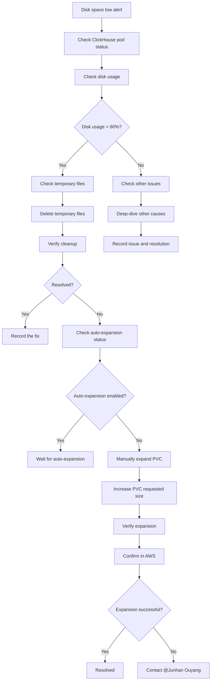

---
metadata:
  kind: runbook
  status: final
  summary: "Oncall runbook for ClickHouse disk space exhaustion: covers Pod/PVC/EBS diagnosis, disk and data directory checks, temporary file cleanup, and resize options to quickly restore writes and service stability."
  tags: ["clickhouse", "storage", "disk", "pvc", "ebs"]
  first_action: "Check pod/PVC status and `df -h` in pod"
---

# ClickHouse Disk Space Exhaustion Troubleshooting Guide

## TL;DR (Do This First)
1. Check ClickHouse Pod/PVC health: `kubectl get pods,pvc -n prod | grep -i clickhouse`
2. Confirm disk usage in Pod: `kubectl exec -it <pod> -n prod -- df -h`
3. Identify top consumers: `kubectl exec -it <pod> -n prod -- du -sh /var/lib/clickhouse/* | sort -h | tail -n 20`
4. If write actions are needed (delete data/resize/rollout restart), stop and hand off as `#MANUAL`

## Safety Boundaries
- Read-only: status/log/usage checks
- `#MANUAL`: deleting data, resizing volumes, restarting stateful components

## Quick Reference

### Emergency Contact
- **Primary contact**: @Junhan Ouyang
- **Issue type**: ClickHouse storage and disk space

## Common Issues

### 1. ClickHouse disk space exhaustion

#### Symptoms
```
- ClickHouse service is unhealthy
- Data ingestion/import fails
- Disk usage reaches > 80%
- Pod becomes unhealthy or restarts
```

#### Description
The ClickHouse cluster is low on storage, which can prevent writes and lead to degraded performance or outage.

#### Investigation steps

### 1. Initial diagnosis
```bash
# Check ClickHouse pod status
kubectl get pods -n prod | grep clickhouse

# Describe pod for details
kubectl describe pod <clickhouse-pod-name> -n prod

# Check PVC status
kubectl get pvc -n prod | grep clickhouse
```

### 2. Check storage usage
```bash
# Check disk usage inside the ClickHouse pod
kubectl exec -it <clickhouse-pod-name> -n prod -- df -h

# Check ClickHouse data directory sizes
kubectl exec -it <clickhouse-pod-name> -n prod -- du -sh /var/lib/clickhouse/*

# Find temporary files
kubectl exec -it <clickhouse-pod-name> -n prod -- find /var/lib/clickhouse -name "*.tmp" -type f
```

### 3. Check AWS EBS status
```bash
# Describe PVC to locate the backing volume
kubectl describe pvc <clickhouse-pvc-name> -n prod

# Check the EBS volume in AWS Console:
# 1) Sign in to AWS Console
# 2) Go to EC2 -> Volumes
# 3) Find the corresponding EBS volume
# 4) Check volume state and size
```

## Remediation

### Option 1: Clean up temporary files (fast mitigation)

#### 1. Delete temporary files
```bash
# Enter the ClickHouse pod
kubectl exec -it <clickhouse-pod-name> -n prod -- bash

# Find and delete temporary files
find /var/lib/clickhouse -name "*.tmp" -type f -delete
find /var/lib/clickhouse -name "*.tmp" -type d -exec rm -rf {} +

# Clean ClickHouse temp directories
rm -rf /var/lib/clickhouse/tmp/*
rm -rf /var/lib/clickhouse/store/tmp/*

# Clean old log files (optional)
find /var/lib/clickhouse -name "*.log" -mtime +7 -delete
```

#### 2. Verify cleanup
```bash
# Check disk usage
df -h

# Check ClickHouse pod status
kubectl get pods -n prod | grep clickhouse
```

### Option 2: Check volume auto-expansion

#### 1. Check PVC auto-expansion configuration
```bash
# Describe PVC
kubectl describe pvc <clickhouse-pvc-name> -n prod

# Check whether volume expansion is enabled
kubectl get pvc <clickhouse-pvc-name> -n prod -o yaml | grep -A 5 -B 5 "allowVolumeExpansion"
```

#### 2. Check StorageClass configuration
```bash
# List StorageClasses
kubectl get storageclass

# Describe the StorageClass
kubectl describe storageclass <storageclass-name>
```

#### 3. Check in AWS
- Sign in to the AWS console
- Go to EC2 -> Volumes
- Find the corresponding EBS volume
- Check whether auto-expansion is configured
- Check current size and usage

### Option 3: Manually expand the PVC (recommended)

#### 1. Update the PVC requested size
```bash
# Back up current PVC manifest
kubectl get pvc <clickhouse-pvc-name> -n prod -o yaml > clickhouse-pvc-backup.yaml

# Edit PVC
kubectl edit pvc <clickhouse-pvc-name> -n prod

# Update resources.requests.storage
# Example: from 100Gi to 200Gi
```

#### 2. Verify expansion
```bash
# Check PVC status
kubectl get pvc <clickhouse-pvc-name> -n prod

# Check disk usage inside the pod
kubectl exec -it <clickhouse-pod-name> -n prod -- df -h

# Wait a few minutes and re-check
```

#### 3. Verify in AWS
- Confirm the EBS volume is expanded
- Confirm volume state is "available"
- Confirm the new volume size

## Prevention

### 1. Monitoring
```bash
# Set up disk usage alerts
# Suggested thresholds: 70% warning, 80% critical

# Monitor ClickHouse table sizes
# Periodically inspect large tables and data distribution
```

### 2. Routine maintenance
```bash
#MANUAL
# Periodically clean up temp files (recommended weekly)
kubectl exec -it <clickhouse-pod-name> -n prod -- find /var/lib/clickhouse -name "*.tmp" -type f -delete

# Periodically check disk usage
kubectl exec -it <clickhouse-pod-name> -n prod -- df -h
```

### 3. Configuration improvements
- Enable PVC auto-expansion
- Use a reasonable StorageClass configuration
- Tune ClickHouse data retention

## Incident handling flow



## Common commands

### 1. Checks
```bash
# Check pod status
kubectl get pods -n prod | grep clickhouse

# Check PVC status
kubectl get pvc -n prod | grep clickhouse

# Check disk usage
kubectl exec -it <pod-name> -n prod -- df -h

# Check ClickHouse service
kubectl exec -it <pod-name> -n prod -- clickhouse-client --query "SELECT 1"
```

### 2. Cleanup
```bash
#MANUAL
# Delete temporary files
kubectl exec -it <pod-name> -n prod -- find /var/lib/clickhouse -name "*.tmp" -type f -delete

# Clean temp directories
kubectl exec -it <pod-name> -n prod -- rm -rf /var/lib/clickhouse/tmp/*

# Clean old logs
kubectl exec -it <pod-name> -n prod -- find /var/lib/clickhouse -name "*.log" -mtime +7 -delete
```

### 3. Expansion
```bash
#MANUAL
# Edit PVC
kubectl edit pvc <pvc-name> -n prod

# Watch expansion status
kubectl get pvc <pvc-name> -n prod -w
```

---

**Note**:
1. When disk space is low, try deleting temporary files first.
2. Check the auto-expansion status in AWS.
3. If needed, expand by directly increasing the PVC request size.
4. If the problem persists, contact @Junhan Ouyang.
