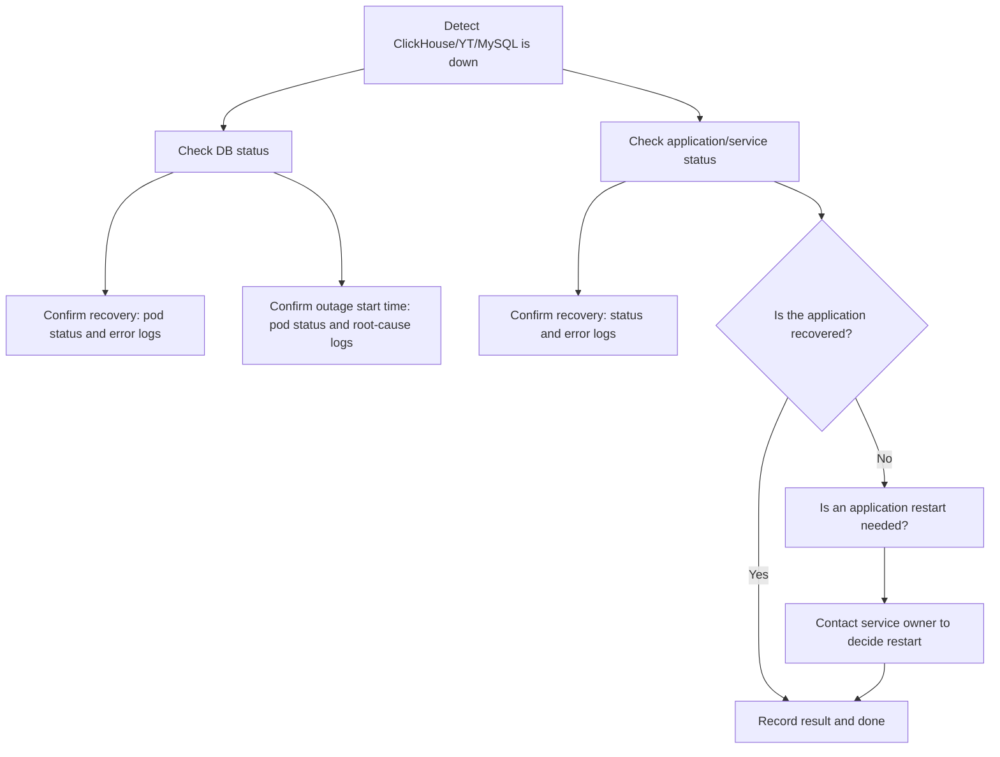

---
metadata:
  kind: runbook
  status: final
  summary: "Oncall troubleshooting flow for database and application incidents: first confirm DB health (pod status and logs for ClickHouse and others) and identify when/why it failed, then verify dependent services recover and keep a clear ownership boundary, using the flowchart to decide whether the service owner should restart."
  tags: ["database", "clickhouse", "troubleshooting"]
  first_action: "Check DB pods and recent error logs"
---

# Oncall Troubleshooting Flow (DB and Application Incidents)

## TL;DR (Do This First)
1. Snapshot DB health: pod status + recent error logs
2. Determine time of failure and likely cause (restart/OOM/DiskPressure/network)
3. Verify dependent services recover; if not, hand off restart decisions to service owner (`#MANUAL`)

## Safety Boundaries
- Read-only: get/describe/logs
- `#MANUAL`: restarts, schema/data operations, scaling stateful components

## 1. Check the DB layer

   1. **Confirm whether ClickHouse has recovered**
    - Check pod status:
     ```bash
     kubectl get pods -n <namespace> | grep clickhouse
     ```
    - Check error logs:
     ```bash
     kubectl logs <clickhouse-pod>
     ```
    - This is the most basic confirmation step.

   2. **Confirm when ClickHouse went down**
    - **Pod status**: check RESTARTS and LAST RESTART TIME
    - **Logs**: analyze the root cause (resource exhaustion / crash / network).

## 2. Check the application layer

  1. **Confirm whether the application has recovered**
    - Check fp and other services that depend on the DB:
     ```bash
     kubectl get pods -n <namespace> | grep fp
     ```
    - Check error logs:
     ```bash
     kubectl logs <fp-pod>
     ```

  2. **Decide whether an application restart is needed**
    - If the service has not recovered on its own, decide whether a restart is needed (do not do it yourself; have the service owner perform it).

## Mermaid flowchart


## Notes
Following this flow:
- Check DB first, then the application, then decide whether an application restart is needed.
- Keep a clear ownership boundary: DB side confirms and documents; application restarts are handled by the service owner.
