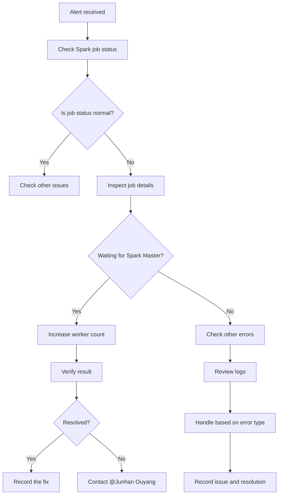

---
metadata:
  kind: runbook
  status: final
  summary: "DCluster Spark Job troubleshooting guide: for common symptoms like \"waiting for spark master ready\", it lists likely causes, short-term and long-term fixes, and kubectl diagnostic commands to help oncall recover jobs quickly and build reusable incident handling steps."
  tags: ["spark", "dcluster", "k8s", "jobs"]
  first_action: "Check spark-master pod status and logs"
---

# DCluster Spark Job Troubleshooting Guide

## TL;DR (Do This First)
1. Confirm symptom: `waiting for spark master ready` and identify affected namespace/job
2. Check spark-master pod status + logs
3. Check cluster capacity (`kubectl top nodes`) and scheduling failures (events)
4. Any scaling/restart/worker pool changes are `#MANUAL`

## Safety Boundaries
- Read-only: get/describe/logs/top
- `#MANUAL`: scaling workers, restarting components, clearing stuck jobs

## Quick Reference

### Emergency Contact
- **Primary contact**: @Junhan Ouyang
- **Issue type**: DCluster Spark Job

## Common Issues

### 1. Spark Job stuck or unhealthy

#### Symptoms
```
Spark Job Status: waiting for spark master ready
```

#### Description
The Spark Job stays in a state waiting for Spark Master to become ready and cannot start normally.

#### Possible causes
- Spark Master service is not running properly
- Insufficient cluster resources
- Network connectivity issues
- Configuration issues

#### Remediation

**Short-term mitigation**:
1. **Increase tenant-info worker count**
   ```bash
    # Increase tenant-info worker count to 60+
    # This often resolves the Spark Master readiness issue
    ```

2. **Check Spark Master status**
   ```bash
    # Check Spark Master pod status
    kubectl get pods -n dcluster | grep spark-master

    # Check Spark Master logs
    kubectl logs -n dcluster <spark-master-pod-name>
    ```

3. **Check cluster resources**
   ```bash
    # Check node resource usage
    kubectl top nodes

    # Check pod resource usage
    kubectl top pods -n dcluster
    ```

**Long-term fixes**:
- Tune Spark cluster configuration
- Increase cluster capacity
- Implement autoscaling

#### Expected time to mitigate
- **Short-term**: immediate
- **Root fix**: expected soon

## Investigation steps

### 1. Initial diagnosis
1. **Check Spark Job status**
   ```bash
   kubectl get sparkapplications -n dcluster
   ```

2. **Inspect Job details**
   ```bash
   kubectl describe sparkapplication <job-name> -n dcluster
   ```

3. **Check related Pod status**
   ```bash
   kubectl get pods -n dcluster | grep spark
   ```

### 2. Deeper analysis
1. **Check Spark Master logs**
   ```bash
   kubectl logs -n dcluster <spark-master-pod-name> --tail=100
   ```

2. **Check Worker status**
   ```bash
   kubectl get pods -n dcluster | grep worker
   ```

3. **Check resource quotas**
   ```bash
   kubectl describe resourcequota -n dcluster
   ```

### 3. Network diagnostics
1. **Check service reachability**
   ```bash
   kubectl get svc -n dcluster | grep spark
   ```

2. **Test network connectivity**
   ```bash
   kubectl exec -n dcluster <pod-name> -- curl -v <spark-master-service>
   ```

## Prevention

### 1. Monitoring
- Add Spark Master health monitoring
- Monitor cluster resource utilization
- Alert on Job runtime anomalies

### 2. Configuration
- Tune Spark resource parameters
- Set reasonable timeouts
- Optimize memory and CPU allocation

### 3. Documentation hygiene
- Record common issues and fixes
- Update the incident runbook
- Review and improve the process periodically

## Resources

### 1. Official docs
- [Spark on Kubernetes](https://spark.apache.org/docs/latest/running-on-kubernetes.html)
- [Kubernetes Spark Operator](https://github.com/GoogleCloudPlatform/spark-on-k8s-operator)

### 2. Internal docs
- DCluster configuration docs
- Spark cluster operations guide
- Incident handling docs

## Incident handling flow



## Contact

### Urgent
- **Primary contact**: @Junhan Ouyang
- **How to reach**: Slack or email
- **Response time**: within 30 minutes for urgent issues

### Non-urgent
- Submit via the ticketing system
- Describe symptoms and what you already tried
- Attach relevant logs and config

---

**Note**: If you hit "waiting for spark master ready", first try increasing tenant info worker count to 60+. This often resolves it quickly. If the issue persists, contact @Junhan Ouyang.

