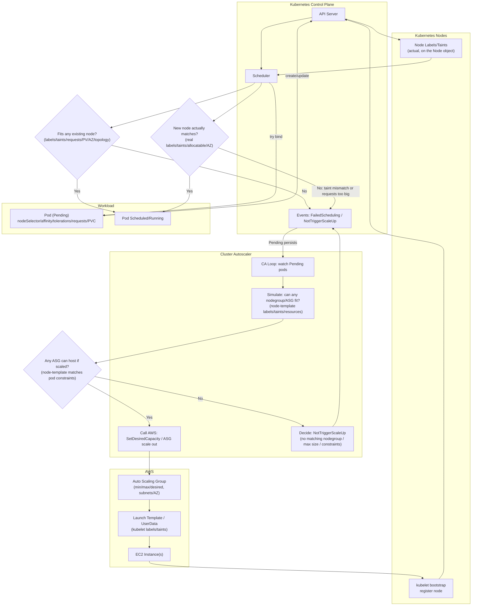

---
metadata:
  kind: runbook
  status: draft
  summary: "Kubernetes Pod Pending scheduling runbook (self-managed ASG + Cluster Autoscaler): triage scheduler events, verify labels/taints/requests, and close the CA 'node-template' tag chain to fix NotTriggerScaleUp. Includes how to map a candidate node to its ASG."
  tags: [k8s, scheduling, pending, aws, asg, cluster-autoscaler, taint, toleration, affinity, node-selector]
  first_action: "Run `kubectl -n <ns> describe pod <pod>` and copy the scheduling events"
---

# Runbook: Pod Pending (Cannot Schedule to Existing ASG / CA Does Not Scale Up)

Applicable scenarios:
- Pod stays `Pending` for a long time; `kubectl describe pod` shows `FailedScheduling` / `NotTriggerScaleUp` in Events.
- Cluster uses self-managed ASG + Cluster Autoscaler (the same troubleshooting model applies to EKS nodegroups too).

## TL;DR (Do This First)
1. Evidence: `kubectl -n <ns> describe pod <pod>`; focus on the first root-cause keyword in Events.
2. Branch: constraints mismatch (label/taint/affinity/topology/PV) vs insufficient resources (requests vs allocatable / maxPods).
3. If you see `NotTriggerScaleUp`: verify the chain closes: ASG CA tags + node-template tags + actual node labels/taints at bootstrap.
4. If you need to answer "which ASG should scale": map a candidate node -> instance-id -> ASG name.

## Diagram: Pod Pending -> Cluster Autoscaler -> ASG -> Node Join


## Safety Boundaries
- Read-only: `kubectl get/describe/top/logs`, `aws *describe*`.
- `#MANUAL`: change Pod constraints/requests, change node label/taint, change ASG tags / LT / UserData, roll instances, scale up/down.

## 0) Evidence capture (required)
```bash
kubectl -n <ns> get pod <pod> -o wide
kubectl -n <ns> describe pod <pod>
kubectl -n <ns> get pod <pod> -o yaml > /tmp/<pod>.yaml
```

Common Event keywords (handle the first primary cause first):
- `Insufficient cpu|memory|ephemeral-storage`
- `Too many pods`
- `node(s) didn't match Pod's node affinity/selector`
- `node(s) had taint {...} that the pod didn't tolerate`
- `node(s) didn't match Pod topology spread constraints`
- `volume node affinity conflict`
- `preemption: ...`
- `NotTriggerScaleUp` (Cluster Autoscaler decides it will not / cannot scale)

## 1) First, classify: what Events can/cannot tell you about "which ASG"
- As long as the Pod is still `Pending / PodScheduled=False`: it is not bound to any node yet, so the answer is: none (it has not landed on any EC2).
- But Events often tell you which constraints are blocking the "eligible node set", which indirectly narrows down to a specific ASG (or ASG class).

## 2) Quickly extract Pod scheduling constraints (read-only)
```bash
kubectl -n <ns> get pod <pod> -o jsonpath='{.spec.nodeSelector}{"\n"}'
kubectl -n <ns> get pod <pod> -o jsonpath='{.spec.affinity}{"\n"}'
kubectl -n <ns> get pod <pod> -o jsonpath='{.spec.tolerations}{"\n"}'
kubectl -n <ns> get pod <pod> -o jsonpath='{.spec.topologySpreadConstraints}{"\n"}'
kubectl -n <ns> get pod <pod> -o jsonpath='{.spec.containers[*].resources}{"\n"}'
```

Scheduling key points:
- Scheduling uses `resources.requests`, not `limits`.
- `requiredDuringScheduling` nodeAffinity is a hard constraint.
- `NoSchedule/NoExecute` taints require matching Pod tolerations.

## 3) "Why existing nodes won't take it": align labels/taints with selector/toleration

### 3.1 Find the candidate node set
(Example: Pod has `nodeSelector: dedicated-node=true`)
```bash
kubectl get nodes -l dedicated-node=true \
  -o custom-columns=NAME:.metadata.name,TAINTS:.spec.taints,NODEGROUP:.metadata.labels.eks\.amazonaws\.com/nodegroup
```

Verify:
- Labels: satisfy Pod `nodeSelector` / `required nodeAffinity`
- Taints: any `NoSchedule/NoExecute` taints, and whether the Pod has matching tolerations

### 3.2 Common root cause: taint mismatch triggers NotTriggerScaleUp
Typical combination:
- Pod：`nodeSelector: dedicated-node=true`
- Node: `dedicated-node-type=mtype:NoSchedule`
- Pod only tolerates: `dedicated-node:NoSchedule` (does not tolerate `dedicated-node-type=mtype`)

Result:
- All existing dedicated nodes are excluded (`didn't tolerate`).
- CA simulation also decides "even if I scale, it still won't fit" (because new nodes will carry the same taint), thus `NotTriggerScaleUp`.

## 4) "Node matches but still Pending": requests vs allocatable / maxPods
For any theoretical candidate node:
```bash
kubectl describe node <node>
kubectl top node <node>  # reference only; scheduling is based on requests
```

Decision rules:
- If any `pod.requests.(cpu|memory|ephemeral-storage)` exceeds remaining allocatable -> it will fail.
- `Too many pods`: node hits maxPods (often related to ENI/IP limits).

## 5) Storage/topology: "nodes exist but it still can't schedule"
- `volume node affinity conflict`: PV/EBS is often AZ-bound; the Pod can only schedule to nodes in the same AZ.
- `topologySpreadConstraints`: spread rules may exclude some zones/nodes.

## 6) Cluster Autoscaler: ASG tag / node-template tag / real node registration must close the loop

### 6.1 CA recognizes ASG (required ASG tags)
Common:
- `k8s.io/cluster-autoscaler/enabled=true`
- `k8s.io/cluster-autoscaler/<cluster-name>=owned|shared`

Read-only check:
```bash
aws autoscaling describe-auto-scaling-groups \
  --auto-scaling-group-names <asg> \
  --query 'AutoScalingGroups[0].Tags'
```

### 6.2 CA decides whether "this ASG can host the Pending Pod" (node-template tags)
When simulating a new node, CA relies on ASG node-template tags to infer the new node's labels/taints.

Common formats:
- label：`k8s.io/cluster-autoscaler/node-template/label/<key>=<value>`
- taint：`k8s.io/cluster-autoscaler/node-template/taint/<key>=<value>:NoSchedule`

Rule:
- Pod-required label/taint constraints must be "promised" via the ASG node-template tags, otherwise CA may judge the ASG unusable for scale-up.

### 6.3 Node bootstrap must materialize the promise on the real Node (LT/UserData/kubelet)
Otherwise: ASG tags look correct, but after the node joins it does not have the expected label/taint, and scheduling still fails.

self-managed common implementation (example):
```text
--node-labels=dedicated-node=true,...
--register-with-taints=dedicated-node-type=mtype:NoSchedule
```

## 7) How to map to "which ASG" (read-only)

### 7.1 Map candidate node -> ASG (recommended)
1) Get node providerID (contains instance id):
```bash
kubectl get node <node> -o jsonpath='{.spec.providerID}{"\n"}'
```
2) Use instance id to look up the ASG name:
```bash
aws autoscaling describe-auto-scaling-instances \
  --instance-ids <i-xxxxxxxx> \
  --query 'AutoScalingInstances[0].AutoScalingGroupName' \
  --output text
```

### 7.2 What you can infer from command history
- If your shell history shows `--auto-scaling-group-names <name>` or `--auto-scaling-group-name <name>`, you can get the ASG name you operated on / intended to operate on.
- But command history cannot prove which ASG the current candidate nodes belong to; you must confirm via the 7.1 node -> instance -> ASG chain.

## 8) Verification
- `kubectl -n <ns> get pod <pod> -o wide` shows a nodeName, and `PodScheduled=True`.
- In CA scale-up scenarios: the new node joins with the expected label/taint, and the Pod schedules onto it.

## 9) Closeout Checklist
- Record the root cause: requests > allocatable, taint/toleration mismatch, missing node-template tags, or AZ/PV constraints.
- Record the fix: Pod spec / ASG tags / LT(UserData) / rollout approach.
