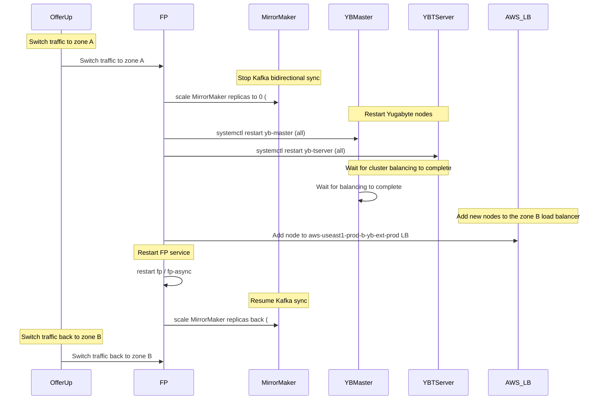
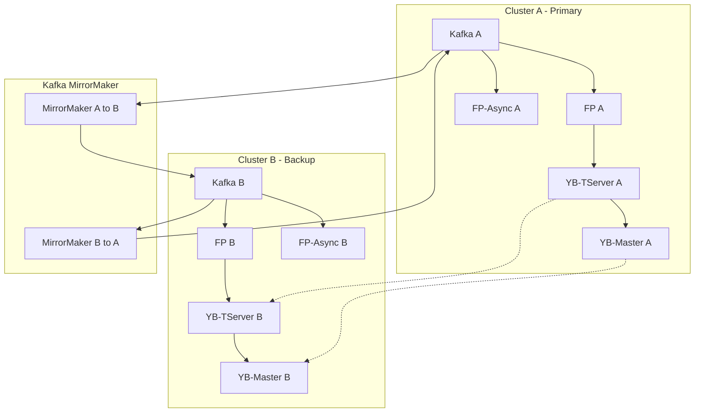

---
metadata:
  kind: runbook
  status: draft
  summary: "Emergency recovery sequence for Yugabyte-related incidents: switch traffic, stop MirrorMaker, restart yb-master/yb-tserver, wait for balance, update LB targets, then restore FP and sync components to reduce cascading failure risk."
  tags: ["yugabyte", "incident", "recovery", "mirrormaker"]
  first_action: "Reduce blast radius (switch traffic + stop MirrorMaker) (`#MANUAL`)"
---

# Yugabyte Incident Recovery Steps (Runbook)

## TL;DR (Do This First)
1. Confirm impact + decide whether to switch traffic (`#MANUAL`)
2. Stop cross-cluster sync to reduce blast radius (MirrorMaker) (`#MANUAL`)
3. Recover Yugabyte control plane then data plane (yb-master -> yb-tserver) (`#MANUAL`)
4. Wait for rebalance/balance to complete before restoring dependent services
5. Restore FP/fp-async and then re-enable MirrorMaker (`#MANUAL`)

## Safety Boundaries
- This runbook contains production write actions; execute only with human approval.
- Marked as `#MANUAL`: traffic switching, scaling deployments, systemctl restarts, LB target changes.

-
## Stop / Escalate When
- You cannot clearly scope impact (single tenant vs global) before switching traffic
- You do not have a verified rollback plan for any `#MANUAL` action (MirrorMaker/yb-master/yb-tserver/LB)
- Any step requires touching production data or changing replication topology beyond this runbook

## Exit Criteria
- Traffic is stable on the chosen cluster (error rate/latency back to baseline)
- Yugabyte masters + tservers are healthy and rebalanced
- MirrorMaker is running and lag is recovering/stable (if re-enabled)
- FP/fp-async are healthy; no sustained backlog/regression

## Verification
- Yugabyte dashboards show stable leader elections and no sustained overload/bootstrapping errors
- Dependent services error rate decreases and stays low for >= 15-30 minutes

One typical Yugabyte incident recovery flow, involving the application layer (fp) and a foundational component (MirrorMaker).

1. Switch OfferUp traffic to cluster A
2. Stop Kafka MirrorMaker (A and B)
kubectl scale --replicas 0 deployment -n prod  mirrormaker2
3. Restart Yugabyte yb-master on all nodes
systemctl restart yb-master
4. Restart Yugabyte yb-tserver on all nodes
systemctl restart yb-tserver
5. Wait for Yugabyte balance to complete
6. Add the new node to the `aws-useast1-prod-b-yb-ext-prod` LB https://us-east-1.console.aws.amazon.com/ec2/home?region=us-east-1#TargetGroup:targetGroupArn=arn:aws:elasticloadbalancing:us-east-1:480609039449:targetgroup/aws-useast1-prod-b-yb-ext-prod/acf8b6179eda946b
7. Restart fp/fp-async
8. Start Kafka MirrorMaker
9. Switch OfferUp traffic back to cluster B

